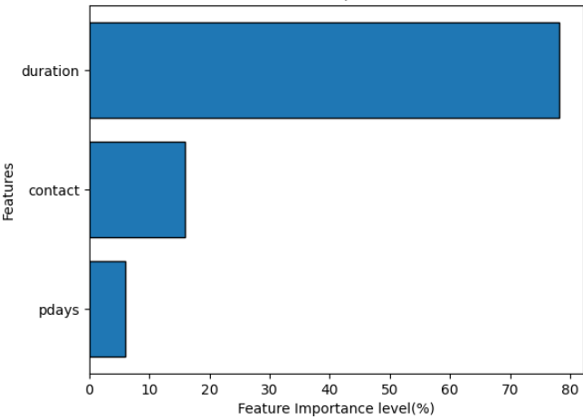
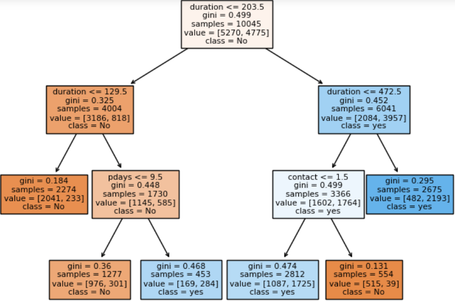

# 📊 Term Deposit Subscription Prediction  


A machine learning project that predicts **bank customers’ likelihood of subscribing to a term deposit** using a Decision Tree classifier.  
This project not only builds a model but also provides **business insights** to optimize marketing campaigns, reduce costs, and improve conversion rates.  

---

## 🚀 Executive Summary  

- ✅ **Model Accuracy**: 82.9% (Cross-Validation: 78.5%)  
- 📌 **Top Success Factor**: Call duration (78.2% importance)  
- 👔 **Target Market**: Management-level professionals with secondary education  
- 📱 **Best Contact Strategy**: Cellular contact with longer, quality conversations  
- 📅 **Best Campaign Timing**: June shows peak subscription rates  

---

## 📂 Dataset  

- **Size**: 11,162 customer records  
- **Features**: 16 (demographics, financial, and campaign details)  
- **Target**: Subscription (`Yes` / `No`)  
- **Class Balance**: 52.6% Non-subscribers | 47.4% Subscribers  

---

## 🔑 Key Insights  

### 👔 Employment Patterns  
- Management roles show the **highest subscription rates**  
- Students show the lowest engagement  

### 🎓 Education  
- Secondary education clients subscribe the most  
- Higher education also strong, but primary education shows low interest  

### 💰 Financial Characteristics  
- Moderate account balances (500–2000) → **best target segment**  
- Customers **without housing loans** subscribe more  

### 📞 Campaign Effectiveness  
- Cellular > Telephone (for conversions)  
- **Call duration is the single strongest predictor** of success  

---

## 📈 Model Performance  

| Metric       | Score |
|--------------|-------|
| Accuracy     | 76.2% |
| Precision    | 69.5% |
| Recall       | 86.4% |
| F1-Score     | 77.0% |

**Decision Pathway Example:**  
1. Was the call long enough? (Duration)  
2. Was the contact cellular?  
3. Did the customer show interest in past campaigns?  

---

## 🧭 Strategic Recommendations  

- 🎯 **Target Segments**:  
  - Management professionals (35–55 yrs)  
  - Married, secondary-educated clients  
  - Non-defaulters with moderate balances  

- 📞 **Contact Strategy**:  
  - Prioritize cellular calls  
  - Focus on **quality, longer conversations**  
  - Implement call scripts to boost engagement  

- 📅 **Campaign Planning**:  
  - Allocate ~60% of budget to high-probability prospects  
  - Run peak campaigns in **June**  

---

## 🛠️ Tech Stack  

- **Language**: Python   
- **Libraries**: Pandas, Scikit-Learn, Matplotlib, Seaborn  
- **Model**: Decision Tree Classifier 🌳  
- **Tools**: Jupyter Notebook, GitHub  

---

## 📌 Project Structure  

```bash
├── bank.csv                              # Dataset files
├── DECISION TREE PROJECT.ipynb           # Jupyter notebooks (EDA, Modeling)
├── app.py                                # App for deploment
├──requirements.txt                       # System requirements for reproducable results
├── decision_tree_model.pkl               # Saved ML model
├── label_encoders.pkl                    # Saved Label encoder
├── visuals/                              # Charts and plots
        └── td1.png                       # Feature importance diagram
        └── td3.png                       # Decision Tree Classifier
└── README.md                             # Project documentation
````

---

## 📌 Visual Preview

### 🔥 Feature Importance



### 📊 Decision Tree



---

## 🤝 Contributing

1. Open a Pull Request 🚀

---

## 👤 Author

**Gift Kalu**
Your Creative Data Scientist ✨
[LinkedIn](https://www.linkedin.com/in/gift-kalu)

---
